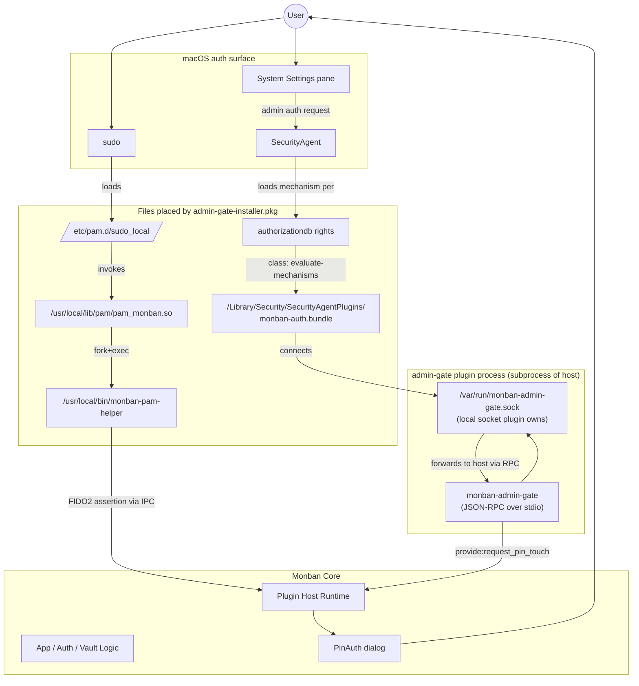
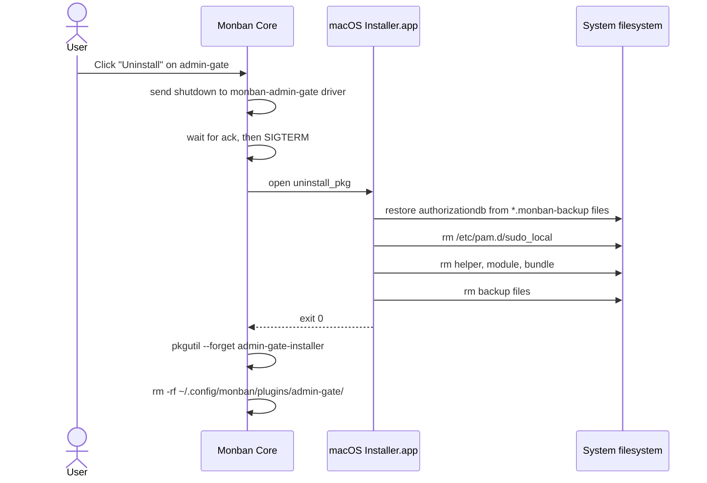
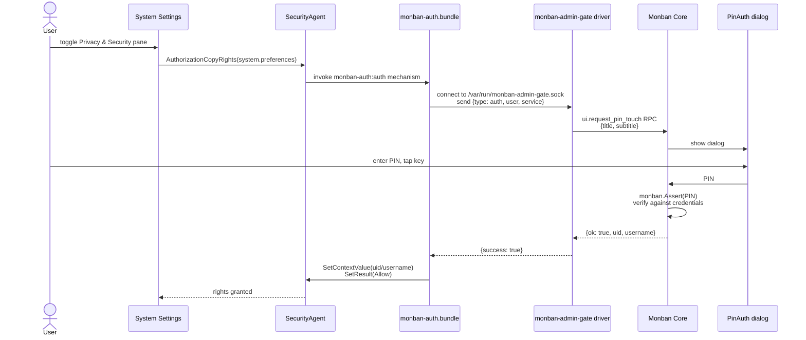

# Plugin Spec — `admin-gate`

## Status

Spec for re-implementing the existing 0.4.0 admin-gate feature as the first
official Monban plugin. Depends on the plugin host runtime defined in
[`plugin-system.md`](plugin-system.md).

This is the **forcing function** for the plugin API: if the runtime can
support admin-gate end-to-end, it can support most other system plugins.

## Purpose

Gate macOS admin actions behind the user's YubiKey:

- `sudo` (terminal and any process invoking it)
- Native admin authorization dialogs in System Settings, Installer.app,
  and elsewhere — toggling Privacy & Security panes, Network changes,
  Software Update, etc.

When the plugin is installed and active, admin actions request a PIN+touch
on the user's registered YubiKey instead of (or in addition to) the macOS
account password.

## Non-goals

- **Linux support.** Linux's `/etc/pam.d/sudo` is writable as root and the
  current 0.4.0 helper already supports it. The plugin is darwin-only;
  Linux admin-gate stays in its current shape (or moves to a separate
  `admin-gate-linux` plugin later).
- **Gating Directory Services operations.** Apple's `AdminDSAuthenticator`
  expects a real password in the auth context. We deliberately don't
  rebind `system.preferences.accounts`, `system.services.directory.configure`,
  or `system.csfde.requestpassword` — those would crash Apple's code.
  Add/remove user, FileVault password retrieval, and similar fall through
  to the macOS password prompt. Acceptable tradeoff; documented in user-
  facing copy.
- **Strict mode at the PAM level.** Out for v1.0 of the plugin. The current
  `auth sufficient` line means failed YubiKey falls through to password.
  A future `strict_mode` setting can swap the PAM control flag to a
  bracketed die-on-failure form; tracked as a follow-up.

## What ships in the plugin tarball

```
admin-gate-1.0.0/
├── manifest.json
├── manifest.json.sig
├── bin/
│   ├── monban-admin-gate-darwin-arm64    # plugin RPC driver (Go)
│   └── monban-admin-gate-darwin-amd64
├── pkg/
│   └── admin-gate-installer-1.0.0.pkg    # signed .pkg run by Installer.app
└── ui/
    └── dist/index.mjs                    # React component for settings tab
```

The `.pkg` itself bundles:

- `monban-pam-helper` (the Go binary PAM execs at sudo time)
- `pam_monban.so` (C PAM module that forks the helper)
- `monban-auth.bundle` (Objective-C SecurityAgent plugin)
- A `postinstall` script that writes `/etc/pam.d/sudo_local`, rebinds
  authorizationdb rights, backs up originals.

These are exactly the artefacts that ship inside `Monban.app` in 0.4.0;
they move out of the app bundle into the plugin's `.pkg`.

## Components and their roles



The four moving pieces:

| Component | Where it lives | What it does |
|---|---|---|
| `monban-admin-gate` | spawned by host, lives in plugin dir | The RPC driver. Talks to the host over stdio JSON-RPC. Owns the local Unix socket the SecurityAgent plugin connects to. Subscribes to lifecycle hooks. |
| `monban-pam-helper` | `/usr/local/bin/`, installed by `.pkg` | Standalone Go binary that PAM execs at sudo time. Performs FIDO2 assertion via TTY, or falls back to IPC (asks the running Monban host to drive a PIN dialog). |
| `pam_monban.so` | `/usr/local/lib/pam/`, installed by `.pkg` | Tiny C PAM module. Forks the helper, maps exit code to PAM return value. |
| `monban-auth.bundle` | `/Library/Security/SecurityAgentPlugins/`, installed by `.pkg` | Objective-C SecurityAgent plugin. Loaded by macOS for rebound authorizationdb rights. Connects to the plugin's local socket to drive the FIDO2 dance via the host. |

The `.pkg` is the install-time mechanism for getting files into root-owned
locations on macOS Tahoe (where the plugin's own runtime can't write
`/etc/pam.d/`). The plugin **tarball** is ed25519-signed by the Monban
release key; the `.pkg` itself is unsigned (no Apple Developer ID
involvement, matching the main app's stance). The host invokes the `.pkg`
via `/usr/sbin/installer -pkg ... -target /` from inside its own process,
which bypasses Gatekeeper since the tarball signature already established
trust.

## Manifest

```jsonc
{
  "name": "admin-gate",
  "version": "1.0.0",
  "monban_api": "1.0",
  "description": "Gate sudo and macOS admin authorization dialogs behind your YubiKey.",
  "homepage": "https://github.com/flythenimbus/monban-plugins/tree/main/admin-gate",
  "author": "Monban Project",

  "platforms": ["darwin-arm64", "darwin-amd64"],
  "kind": ["system", "ui"],

  "binary": {
    "darwin-arm64": "bin/monban-admin-gate-darwin-arm64",
    "darwin-amd64": "bin/monban-admin-gate-darwin-amd64"
  },

  "install_pkg":   "pkg/admin-gate-installer-1.0.0.pkg",
  "uninstall_pkg": "pkg/admin-gate-uninstaller-1.0.0.pkg",

  "ui_panel": "ui/dist/index.mjs",

  "hooks": [
    "on:app_started",
    "on:app_shutdown",
    "on:settings_changed"
  ],

  "provides": [],

  "settings": {},

  "capabilities": [
    "system_paths:/etc/pam.d",
    "system_paths:/usr/local/bin",
    "system_paths:/usr/local/lib/pam",
    "system_paths:/Library/Security/SecurityAgentPlugins",
    "authorizationdb:rebind",
    "pkg_postinstall",
    "ipc:unix_socket"
  ]
}
```

Notes on fields specific to this plugin:

- `kind` includes both `system` (for the install-time `.pkg`) and `ui`
  (for the settings panel that shows install state, recovery snippet,
  and the un-gated rights list).
- `provides: []` — admin-gate doesn't participate in the auth chain. It
  reacts to OS-level events instead.
- `settings: {}` — v1.0 has no toggles. Strict mode (no password fallback)
  is the obvious first setting to add post-1.0.
- `capabilities` is purely informational. The Plugins UI shows it as a
  "this plugin will" disclosure before install.

## Install flow

```mermaid
sequenceDiagram
    actor User
    participant App as Monban Core
    participant GH as GitHub Releases
    participant Installer as macOS Installer.app
    participant FS as System filesystem

    User->>App: Click "Install" on admin-gate
    App->>GH: GET admin-gate-1.0.0.tar.gz + sig
    App->>App: verify ed25519 sig with embedded key
    App->>App: extract to ~/.config/monban/plugins/admin-gate/
    App->>Installer: open install_pkg via /usr/sbin/installer
    Note over Installer: User sees Installer prompt;<br/>monban-auth gates with YubiKey<br/>after first successful install
    Installer->>FS: copy helper, module, bundle
    Installer->>FS: write /etc/pam.d/sudo_local
    Installer->>FS: rebind authorizationdb rights<br/>(backups → *.monban-backup)
    Installer-->>App: exit 0
    App->>App: spawn monban-admin-gate driver
    App->>App: register hooks (lifecycle)
```

The host doesn't do the privileged file writes itself — it delegates to
Installer.app via the bundled `.pkg`. The `.pkg` is signed with the same
release key that signs the plugin (separate Apple signing infrastructure
NOT involved by design — this matches the project's "no Apple signing"
stance, with the same Gatekeeper friction as the main Monban pkg).

## Uninstall flow



The uninstaller `.pkg` is shipped alongside the install `.pkg` so the
restoration logic versions with the install logic — matching backup file
names and right names is critical and they should never drift.

## Runtime behaviour

### Sudo path

Unchanged from 0.4.0. The PAM module forks the helper, which negotiates
the FIDO2 assertion either over TTY (terminal sudo) or via IPC to the
running Monban host (GUI contexts). The plugin's own RPC driver is NOT in
this critical path — the helper talks directly to the host's existing IPC
socket at `~/.config/monban/monban.sock`.

The plugin's role here is install-time only: it shipped the helper, the
PAM module, and the PAM config. The user's existing IPC infrastructure
serves the auth requests.

### Authorization dialog path



### Caches owned by the plugin driver

The plugin's own driver (or the bundle, depending where we put the cache
in the refactor) owns:

- **Success cache (60s)** — after a successful PIN+touch, subsequent
  `auth.bundle` requests within 60s skip the host RPC and return Allow
  immediately. Mirrors sudo's 5-minute password cache, matches the
  current 0.4.0 behaviour.
- **Denial cache (10s)** — after a user cancels, suppresses subsequent
  prompts in the same admin operation (`writeconfig.xpc` typically fans
  one user-action into many auth requests).

These caches are purely the plugin's concern. The host doesn't know about
them. If the plugin is uninstalled, the caches go with it.

## Settings (v1.0 — empty; future shape)

v1.0 has no settings. Forward-looking shape for follow-ups:

```jsonc
{
  "settings": {
    "strict_mode": {
      "type": "bool",
      "default": false,
      "label": "No password fallback (strict)",
      "description": "If your YubiKey is unavailable, sudo and admin dialogs cannot proceed. Recovery requires Recovery Mode."
    },
    "include_su_recovery_hint": {
      "type": "bool",
      "default": true,
      "label": "Show /etc/pam.d/su hardening hint in the panel"
    }
  }
}
```

The settings UI is rendered from this schema by the host when no
`ui_panel` is provided. The plugin DOES ship a `ui_panel` for v1.0 so it
can show install state ("admin-gate is installed and active"), the
backup file locations, and the un-gated rights list (for transparency).

## Lifecycle hooks the plugin reacts to

| Hook | Plugin behaviour |
|---|---|
| `on:app_started` | Driver process is spawned by host. Driver opens its local Unix socket and starts accepting connections from `monban-auth.bundle`. |
| `on:app_shutdown` | Driver closes the socket, exits. Host SIGTERMs after grace period. |
| `on:settings_changed` (own settings) | Re-read settings, adjust runtime behaviour (e.g. cache TTLs, strict mode). No PAM rewrites at runtime — those happened at install time. |

Notably **not** subscribed to:

- `on:vault_unlocked`, `on:vault_locked`, `on:key_*` — admin gate doesn't
  care about vault state.
- `auth.gate` provider — admin gate is install-time, not unlock-time.

## Security considerations

- **Signing.** Plugin tarball + manifest signed by the Monban release key
  (ed25519, embedded in core at build time). The bundled `.pkg` is
  **unsigned** — the trust comes from the verified tarball that contains
  it. Host runs the `.pkg` via `installer` CLI to bypass Gatekeeper.
- **No master secret access.** The driver receives no key material from
  the host. PIN/touch happens in the host's own process; the driver gets
  back only `{ok, uid, username}` for the SecurityAgent contract.
- **No new attack surface vs 0.4.0.** The current 0.4.0 admin gate has
  the same PAM module, helper, bundle, and authorizationdb rebind. Moving
  it into a plugin doesn't change what's exposed; it just changes how it's
  installed and managed.
- **Lockout recovery.** If admin-gate is the only auth path and the user
  loses their YubiKey, sudo falls through to password (default behaviour
  in v1.0). Strict mode flips this to no fallback — that needs a documented
  Recovery Mode escape (already covered in main README's "Advanced
  Hardening" section, which we'll keep aligned).

## Repo layout (in-tree)

The plugin lives alongside the core in the main Monban repo:

```
oslock/
├── desktop/                                       — core app
└── plugins/
    └── admin_gate/
        ├── README.md
        ├── manifest.json                          # canonical, in-repo
        ├── go.mod / go.sum
        ├── cmd/
        │   ├── driver/                            # monban-admin-gate (RPC subprocess)
        │   ├── pam-helper/                        # monban-pam-helper (Go)
        │   ├── pam-module/pam_monban.c            # C PAM .so
        │   └── auth-plugin/monban_auth_plugin.m   # Objective-C SecurityAgent plugin
        ├── pkg/
        │   ├── distribution.xml
        │   ├── scripts/
        │   │   ├── preinstall
        │   │   ├── postinstall
        │   │   └── gated-rights.sh                # canonical list (sourced by both)
        │   └── resources/
        │       └── welcome.html
        ├── ui/
        │   ├── src/index.tsx                      # React component
        │   ├── package.json
        │   └── tsconfig.json
        └── Taskfile.yml                           # build, sign, package, release
```

Most of these files already exist under `desktop/cmd/` and
`desktop/build/darwin/pkg/` from the 0.4.0 implementation; P3 moves them
into this layout rather than reinventing.

## Build and release

Each plugin release is one CI run that produces:

1. `monban-admin-gate-darwin-arm64`, `monban-admin-gate-darwin-amd64`
   — the driver binaries.
2. `admin-gate-installer-1.0.0.pkg` — the install `.pkg`, with the same
   structure as today's main Monban pkg (productbuild + pkgbuild,
   `BundleIsRelocatable=false` to avoid relocation, ad-hoc codesign on
   the binaries inside).
3. `admin-gate-uninstaller-1.0.0.pkg` — the matching uninstall pkg.
4. `ui/dist/index.mjs` — the bundled UI panel (Vite build).
5. `manifest.json`, `admin-gate-1.0.0.tar.gz` containing all the above.
6. `manifest.json.sig` and `admin-gate-1.0.0.tar.gz.sig` (ed25519 sigs
   from the release-key in CI secrets).

CI uploads everything to the same GitHub Release as the core binaries,
distinguished by name. The signed `plugins-index.json` listing all official
plugins gets regenerated and re-signed on each release.

Signing uses the in-tree `cmd/monban-sign` binary — same tool the core
uses for verification, just running in sign mode with the release-key
imported from a GitHub Actions secret.

## Phased delivery

Aligns with `plugin-system.md`'s P3:

1. **P0 (already planned)** — strip admin-gate from core. Core 0.5.0 ships
   with NO admin-gate at all.
2. **P1 + P2 (host work)** — build the plugin host runtime, lifecycle
   hooks, Plugins UI, sig verification.
3. **P3 (this doc)** — port the existing admin-gate code into a plugin
   under this spec. First release: `admin-gate@1.0.0`.

Between P0 and P3, users who want admin-gate stay on Monban 0.4.0. After
P3 they upgrade to 0.5.x and install the plugin from the Plugins tab.

## Resolved decisions

- **No migration from 0.4.0.** Pre-release; 0.4.0 users keep their
  existing `/etc/pam.d/sudo_local` + authorizationdb rebinds even after
  upgrading to core 0.5.x. When they install `admin-gate@1.0`, the new
  pkg's postinstall will treat the existing files as already-installed
  (idempotent — backups are only taken if not already present, files are
  overwritten with current content). Documented in 0.5.0 release notes.
- **Repo layout.** In-tree at `plugins/admin_gate/` (matches the framework
  doc).
- **`.pkg` signing.** Unsigned. Tarball sig is the trust boundary.
- **Caches live in the bundle.** Status quo from 0.4.0. The bundle's
  in-memory success/denial cache is private state of the SecurityAgent
  plugin and doesn't need to surface to the host.

## Open questions

- **Bundle ↔ driver IPC vs bundle ↔ host IPC.** Today the bundle talks
  directly to the host via `~/.config/monban/monban.sock`. Two options
  after extraction:
  - Keep direct host IPC. Simpler; driver only handles install-time and
    lifecycle, not runtime auth. Faster to ship.
  - Route through the driver via a new socket
    `/var/run/monban-admin-gate.sock`. Cleaner host/plugin boundary, but
    real work.

  Lean: ship "keep direct" first, refactor to driver-routed in a
  later admin-gate version if a real reason emerges.

## Related documents

- [`plugin-system.md`](plugin-system.md) — overall plugin framework this
  spec implements against.
- [`macos_install.md`](macos_install.md) — Phase 2.5 history; explains
  why admin-gate uses install-time `.pkg` postinstall.
- `desktop/CLAUDE.md` §9a — current 0.4.0 admin-gate description; will
  be removed when admin-gate ships out of core.
