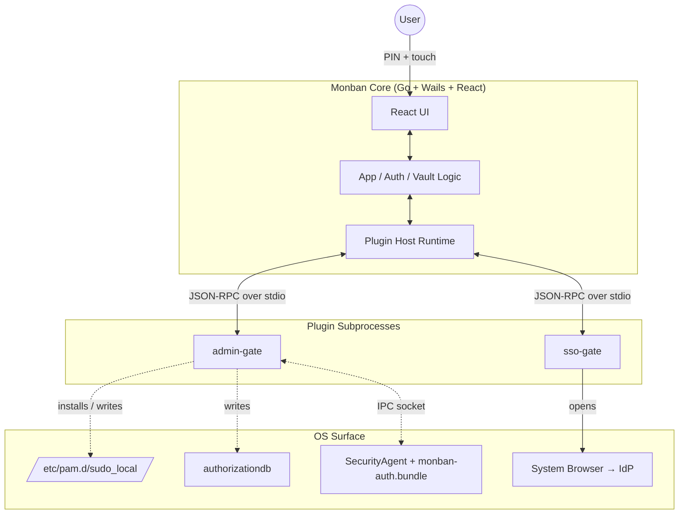
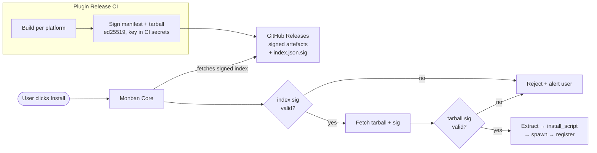
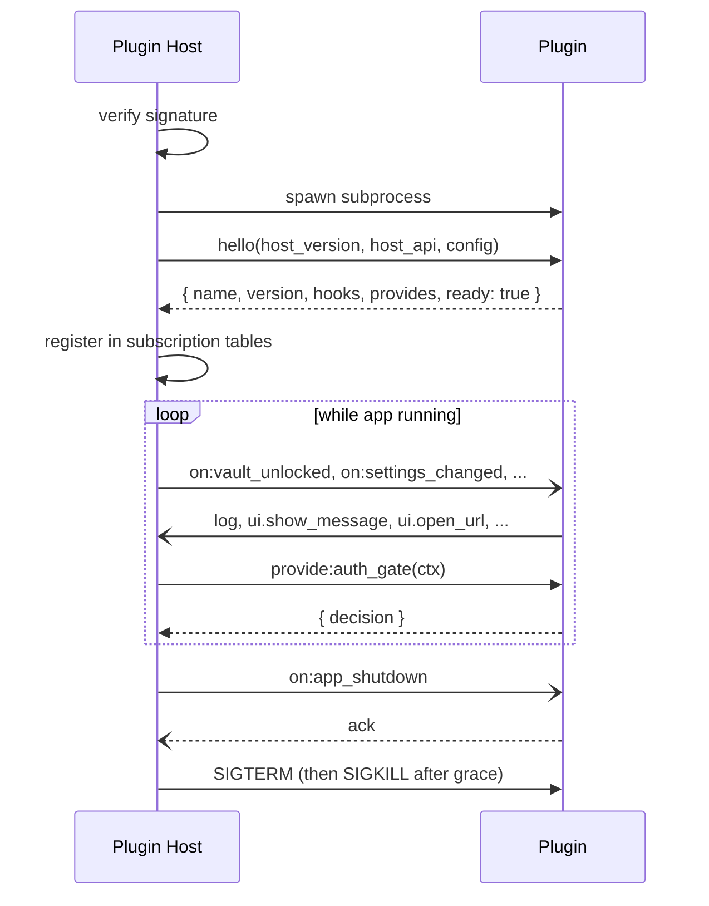
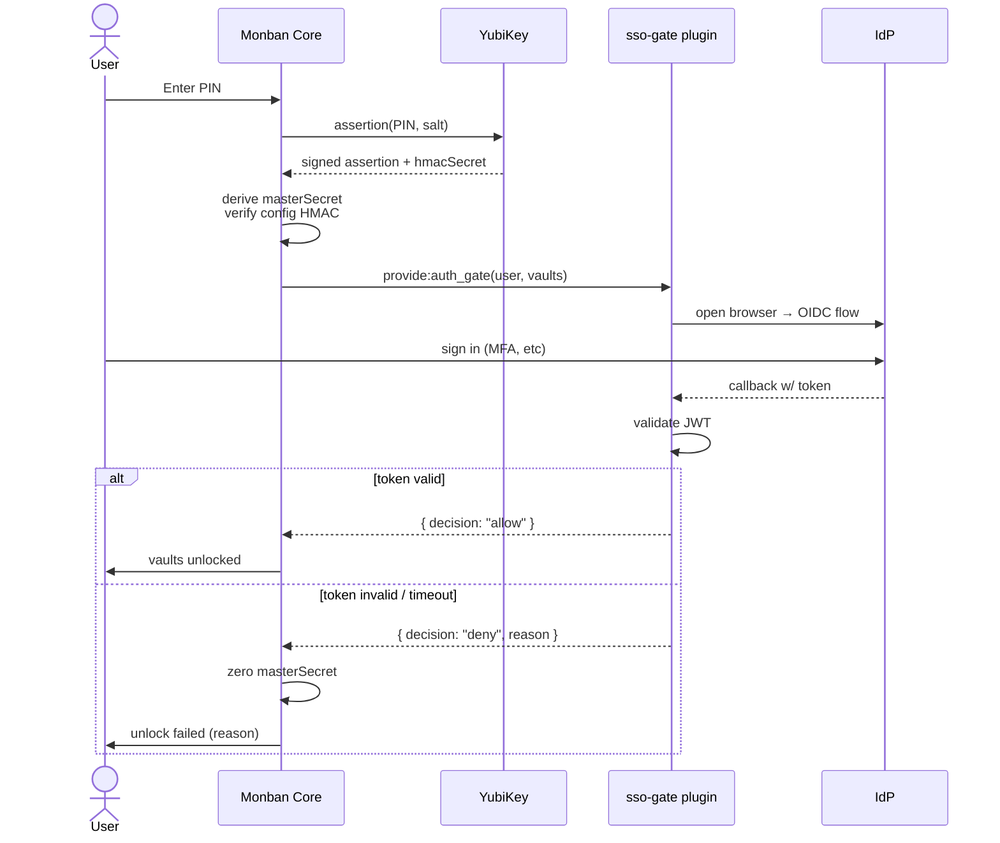
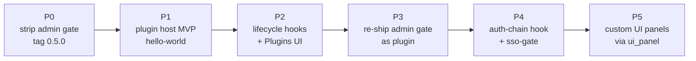

# Plugin System — Design

## Status

Design phase. No code written. Use cases, architectural decisions, and phased
path forward. Intended to be iterated in PRs before implementation starts.

## Motivation

The core Monban app should do one thing well: **encrypt files behind a YubiKey
FIDO2 assertion**. Everything else — admin-gate integration, cloud backup,
alternate auth chains (SAML/SSO), OS-specific hardening, audit logs — bloats
the core and drags in surface area that most users don't want.

The plugin system is the mechanism for:

1. Keeping the core minimal and auditable.
2. Letting security-conscious users opt into additional hardening without
   compromising users who want the simple flow.
3. Supporting integrations (corporate SSO, SIEM, cloud providers) that would
   be out-of-scope as core features but are reasonable as installable extensions.

The admin-gate feature, currently in core (0.4.0), is the first candidate for
extraction — and the forcing function that proves the plugin API is
expressive enough to handle real system-level integrations.

## Non-goals

- **Community plugin marketplace.** Plugins are **official-only**. The
  security value of Monban is undermined if arbitrary third parties can ship
  code that participates in the auth chain or handles master secrets. Anyone
  who wants a custom integration can fork the project — the plugin model
  optimizes for safely shipping curated extensions, not for an open ecosystem.
- **Runtime sandboxing against malicious plugin code.** We trust official
  plugins to do what their manifest claims. Capabilities in the manifest are
  user-facing disclosure, not enforced isolation. (This means the
  signing/release process is the real security boundary — see below.)
- **Dynamic in-process Go plugins.** Go's `plugin` package is broken on
  Windows, brittle on version mismatches, and can't unload. Out of scope.

## Scope

**In:**

- A plugin host runtime inside the core app.
- A signed-manifest distribution model with ed25519 signatures against a
  single embedded project key.
- Lifecycle hooks that plugins can subscribe to.
- Auth-chain participation (provider hook) so plugins like SSO can veto
  unlocks.
- Install/uninstall flow via the app UI, including native postinstall
  scripts where necessary (admin gate).
- A plugins tab in the admin panel.

**Out (first pass):**

- WebAssembly plugin runtime (future option, not v1).
- Plugin-to-plugin dependencies (forbidden initially).
- Auto-updates beyond a "new version available" banner.
- Any plugin UI that isn't a React component bundled with the plugin.

## System architecture at a glance



## Use cases driving the design

These two are the initial targets, chosen because they push the API in
opposite directions:

### Admin gate (extraction of existing 0.4.0 feature)

| Attribute | Value |
|---|---|
| Kind | System plugin |
| Platform | darwin only |
| Runtime role | Long-lived but mostly idle. Hosts the IPC socket that macOS SecurityAgent's authorization plugin connects to. |
| Install footprint | Writes `/etc/pam.d/sudo_local`, drops `pam_monban.so`, `monban-auth.bundle`, rebinds authorizationdb rights |
| Privilege needed at install | Root (delegated via signed sub-`.pkg` that Installer.app runs) |
| Settings | 1-2 toggles (strict mode etc.) |
| Disable semantics | Plugin's own uninstaller restores authorizationdb backups, removes PAM file, deletes installed artefacts |

### Post-key auth gate (SAML / OIDC)

| Attribute | Value |
|---|---|
| Kind | Auth gate provider |
| Platform | all |
| Runtime role | Sits inside the unlock flow. Called after YubiKey success, before vaults open. Can veto. |
| Install footprint | Binary only |
| Privilege needed at install | None |
| Settings | IdP issuer URL, OIDC client ID, callback port, timeout, allowed audiences |
| Disable semantics | Uninstall → unlocks go back to YubiKey-only |

These two use cases mean the plugin surface must support **at least two
integration points**: passive lifecycle observation AND synchronous
participation in the unlock state machine.

## Trust model

One ed25519 keypair, held in CI release secrets. Public key embedded in the
Monban binary at build time.

- Each plugin release includes `manifest.json` and `manifest.json.sig`.
- The tarball itself is signed: `<plugin>-<platform>-<arch>.tar.gz.sig`.
- Core verifies sigs on install AND on every load (sigs over a hash, cheap).
- Sig failure → plugin refuses to load and the app surfaces an alert.
- Signing key lives only in the release workflow; offline key rotation is
  supported by shipping new core versions that embed multiple trusted keys
  during transition.

### Signing tool: `monban-sign`

We ship a small Go binary, `cmd/monban-sign/`, that does the actual ed25519
work. Avoids dragging in `cosign` / `signify` / `minisign` and their
ecosystems — keeps signing inside the project and free of third-party trust.
Same key format the core's verifier uses (`crypto/ed25519`), no format
conversion. Used by CI on release; also runnable locally for ad-hoc dev
testing with throwaway keys.

```
$ monban-sign generate-key  ./release.pub  ./release.key
$ monban-sign sign --key release.key plugins/admin_gate/manifest.json
  → writes plugins/admin_gate/manifest.json.sig
$ monban-sign verify --pubkey release.pub manifest.json manifest.json.sig
  → exit 0 / 1
```

CI imports the private key from a GitHub Actions secret, signs the manifest
and tarball per platform, uploads alongside the artefacts. The private key
never leaves CI.

### macOS `.pkg` signing — explicitly unsigned

Plugins that ship an `install_pkg` (admin-gate is the only one initially)
**do not** sign the `.pkg` with an Apple Developer ID Installer cert. The
plugin tarball IS signed (manifest + tarball ed25519); that's the trust
boundary the core enforces. The unsigned `.pkg` inside means Gatekeeper
will complain if a user tries to double-click it, so the install flow uses
`/usr/sbin/installer -pkg ...` from inside the host process, which bypasses
Gatekeeper. Same stance as the main Monban `.pkg`: no Apple involvement.

Manifest `capabilities: []` is **declarative disclosure**, not a sandbox.
We show the list to the user before install ("this plugin will: write to
`/etc/pam.d/`, launch your browser, call `*.okta.com`"). Because we trust
the plugin code, we don't trap capabilities at runtime — listing them is
about informed consent, not enforcement.



## Distribution

Plugins live **in-tree** under `plugins/<name>/` in the main Monban repo:

```
oslock/
├── desktop/        — core app
├── plugins/
│   ├── admin_gate/
│   ├── sso_gate/
│   └── ...
└── docs/
```

This keeps the plugin code beside the core, simplifies version coordination
(one tag = one matching {core, plugin set}), and avoids the operational
overhead of a separate `monban-plugins` repo. CI builds and signs plugin
tarballs as a separate step in the release workflow; tarballs are uploaded
to the same GitHub Release as the core binaries, distinguished by name.

A known, signed `plugins-index.json` lists the currently-official plugins
and their latest versions (see "Plugin index format" below). The app
fetches it from the latest GitHub Release, verifies the signature, and
presents installable plugins in the Plugins tab.

On install: download tarball + sig → verify → extract to
`~/.config/monban/plugins/<name>/` → run `install_pkg` if present →
spawn the plugin binary → wait for `ready` RPC → register hooks.

## Execution model

**Subprocess per plugin, JSON-RPC over stdio.** HashiCorp's go-plugin
pattern without the gRPC weight.

Why subprocess:

- Crash isolation. A buggy plugin crash doesn't take down the core.
- Trivial to ship native artefacts (admin gate's Objective-C `.bundle`,
  auxiliary binaries) alongside the plugin's RPC driver.
- Matches the admin-gate system-plugin shape naturally — the plugin spawns
  its own helpers and binds its own sockets.
- Easy to drop privileges per plugin later if we ever want to.

Why stdio JSON-RPC (not gRPC):

- No protobuf toolchain burden. Small manifest, reasonable perf for the
  low-frequency RPC the host ↔ plugin exchange.
- Plugins can be authored in any language that can read/write stdio — though
  Go is the recommended SDK.

Plugin lifecycle from the host's perspective:



## Plugin kinds

A plugin declares one (or more) of these in its manifest's `kind` field:

| Kind | Characterised by | Examples |
|---|---|---|
| `system` | Install-time OS modifications; potentially long-lived IPC server | admin-gate |
| `auth_gate` | Provides `auth.gate` provider; participates in unlock flow | sso-gate, webauthn-gate, time-gate |
| `observer` | Listens to lifecycle events only, no provider contribution | audit-log |
| `provider` | Registers a named capability the core delegates to (vault types, backup targets) | cloud-backup-b2 |
| `ui` | Contributes React components to the app's settings tab | all of the above when they have config |

A plugin can be multiple kinds (e.g. admin-gate is `system` + `ui`).

## Lifecycle hooks

Start small. Each new hook is a permanent commitment.

Initial hook surface:

```
on:app_started        — host signals plugins the core is up
on:app_shutdown       — host signals plugins to clean up
on:vault_unlocked     (vaultPath, type)
on:vault_locked       (vaultPath, type)
on:vault_added        (vaultPath, type)
on:vault_removed      (vaultPath, type)
on:key_registered     (credentialID, label)
on:key_removed        (credentialID, label)
on:settings_changed   (pluginName, key, oldValue, newValue)
```

Hooks deliberately NOT in v1 (add as real plugins request them):

- `on:auth_succeeded` / `on:auth_failed` — conflates with `auth.gate` provider
- `on:file_written` inside a vault — scope creep, filesystem-level
- `on:device_plugged` / `on:device_removed` — rarely actually useful

## Provider hooks

These are synchronous request/response, with timeouts. Plugins opt in by
listing them in `provides:`.

```
provide:auth_gate
  request:  { user, vaults[], attempt, plugin_config }
  response: { decision: "allow" | "deny", reason?, ui_message? }
  timeout:  plugin-declared (default 60s)

provide:vault_type (future)
  ...

provide:backup_target (future)
  ...
```

Importantly, `auth_gate` does **not** receive the master secret. The
plugin is told "YubiKey succeeded, here's who wants in, here are the vaults
they're about to unlock" and must return allow/deny. This is defense-in-
depth: even official plugins shouldn't need access to key material to do
their job.

## Auth-chain semantics

The architecturally significant change. Today:

```
PIN + touch  →  derive master secret  →  verify config HMAC  →  unlock vaults
```

With auth gate plugins registered:



Design decisions to pin down:

### Ordering

Sequential, explicit priority. Manifest declares `priority: <int>` on each
auth_gate provider. Lower runs first. Ties broken by plugin name. Rationale:
predictable, debuggable, supports fast-fail plugins (e.g. network check)
before slow ones (SSO browser flow).

### Semantics

Sequential AND. Any single deny → unlock fails. No OR option in v1 —
introduces too many questions ("which plugin's decision wins?").

### Timeout behaviour

Default 60 seconds per plugin. Configurable per plugin in its settings.
UI shows "Verifying with <plugin name>..." and a progress indicator.
Timeout → deny, with a clear "plugin X timed out" message.

### The lockout-recovery problem

**This is the critical design decision.** SSO IdP down or mis-configured →
user can't unlock any vault ever again until the plugin is removed. Need an
escape hatch that's secure but reachable.

Options:

- **A. CLI escape:** `monban --disable-plugins` starts the app without
  loading any plugin. Vaults unlock with just YubiKey. User can uninstall
  the broken plugin from Plugins tab.
- **B. Boot-time keyboard shortcut:** hold a modifier at app launch to
  skip plugin loading. Invisible to most users.
- **C. Last-known-good config revert:** plugins with an `on:install`
  hook also have `on:rollback`; a "reset plugins to last working config"
  button requires PIN+touch to run.
- **D. No escape:** plugins are that load-bearing. Users are expected to
  test their SSO config carefully. Uninstall requires editing the
  `~/.config/monban/plugins/` dir manually.

**Recommended: A + C.** A is for "my IdP is down today" recovery; C is for
"I misconfigured the plugin yesterday." Both require YubiKey to actually
re-enable the plugins, so the boundary holds.

### Does the plugin run per-vault or once per unlock?

Once per unlock. Vaults are a group; if the user passed the gate, they
unlock everything they asked for. Per-vault gating is a future `provider`
kind ("per-vault auth"), not a concern for v1.

## Manifest format

```jsonc
{
  "name": "admin-gate",
  "version": "1.0.0",

  // Which Monban API version this plugin targets. Strict semver on the
  // host API surface.
  "monban_api": "1.0",

  // Presented in the Plugins tab before install.
  "description": "Gate sudo and macOS admin dialogs behind your YubiKey",
  "homepage": "https://github.com/flythenimbus/monban-plugins/tree/main/admin-gate",

  // Per-platform binaries. Plugin refuses to install on unsupported platforms.
  "platforms": ["darwin-arm64", "darwin-amd64"],

  // Primary kind. Multi-kind plugins use an array.
  "kind": ["system", "ui"],

  // Lifecycle hooks the plugin subscribes to.
  "hooks": ["on:app_started", "on:app_shutdown", "on:settings_changed"],

  // Provider capabilities the plugin offers.
  "provides": [],

  // Entry point. Host spawns this. Relative to the extracted plugin root.
  "binary": {
    "darwin-arm64": "bin/monban-admin-gate-arm64",
    "darwin-amd64": "bin/monban-admin-gate-amd64"
  },

  // Optional install-time .pkg. Host hands to Installer.app (signed by the
  // same release key, notarized separately if we start signing).
  "install_pkg": "admin-gate-installer-1.0.0.pkg",
  "uninstall_pkg": "admin-gate-uninstaller.pkg",

  // Optional UI bundle (ES module, React component exported as default).
  // Loaded into the Plugins > <plugin> settings panel.
  "ui_panel": "ui/dist/index.mjs",

  // Settings schema. Host renders automatic UI from this if no ui_panel
  // is provided.
  "settings": {
    "strict_mode": {
      "type": "bool",
      "default": false,
      "label": "No password fallback",
      "description": "YubiKey is mandatory; don't fall through to macOS password on failure."
    }
  },

  // Declarative disclosure — shown to user pre-install. Not enforced.
  "capabilities": [
    "system_paths:/etc/pam.d",
    "system_paths:/Library/Security/SecurityAgentPlugins",
    "pkg_postinstall",
    "ipc:unix_socket"
  ]
}
```

SSO gate manifest, for contrast:

```jsonc
{
  "name": "sso-gate",
  "version": "1.0.0",
  "monban_api": "1.0",
  "description": "Require successful OIDC sign-in after YubiKey",
  "platforms": ["darwin-arm64", "darwin-amd64", "linux-amd64", "linux-arm64"],
  "kind": ["auth_gate", "ui"],
  "hooks": ["on:app_started", "on:app_shutdown"],
  "provides": [{ "name": "auth.gate", "priority": 100, "timeout_seconds": 120 }],
  "binary": {
    "darwin-arm64": "bin/monban-sso-gate-darwin-arm64",
    "darwin-amd64": "bin/monban-sso-gate-darwin-amd64",
    "linux-amd64":  "bin/monban-sso-gate-linux-amd64",
    "linux-arm64":  "bin/monban-sso-gate-linux-arm64"
  },
  "ui_panel": "ui/dist/index.mjs",
  "settings": {
    "issuer_url":  { "type": "url",    "required": true,  "label": "IdP issuer URL" },
    "client_id":   { "type": "string", "required": true,  "label": "OIDC client ID" },
    "scopes":      { "type": "string", "default":  "openid profile email", "label": "Scopes" },
    "callback_port": { "type": "int",  "default":  0,     "label": "Callback port (0 = auto)" },
    "allowed_subs":  { "type": "list<string>", "label": "Allowed subject IDs (optional pinning)" }
  },
  "capabilities": [
    "network:outbound",
    "localhost_listener",
    "open_url_in_browser"
  ]
}
```

## Host ↔ plugin RPC

Newline-delimited JSON over stdio. Each message:

```jsonc
{
  "id": "<uuid>",            // request correlation id
  "type": "request" | "response" | "notify" | "error",
  "method": "<method>",      // on requests/notifies
  "params": { ... },         // on requests/notifies
  "result": { ... },         // on successful responses
  "error":  { "code": <int>, "message": <str>, "data": {...} }  // on errors
}
```

Initial method set:

**Host → plugin:**

- `hello`: `{ host_version, host_api, config: {...} }` → plugin replies with
  `{ name, version, hooks, provides, ready: true }`
- `on:<event>`: notify, params match hook signature
- `provide:auth_gate`: request, params = unlock context, response =
  `{ decision, reason?, ui_message? }`
- `settings.apply`: request, params = new settings object; plugin validates
  and returns `{ ok: bool, errors?: [...] }`
- `shutdown`: notify, expect exit within N seconds

**Plugin → host:**

- `log`: notify, `{ level, message }` — plugin logs forwarded to host log
- `ui.show_message`: notify, `{ level, message, ttl_ms }` — pop a toast in
  the app
- `ui.open_url`: request, `{ url }` — host opens URL in system browser
- `request_pin_touch`: request (rare — most plugins don't need this) —
  surfaces a PinAuth dialog in the host, returns success/failure

## Implementation conventions

Defaults to start with. Each can be revisited once a real plugin demands
something different, but a fresh implementation should follow these
without hesitation.

### Host package layout

All plugin-host code lives under `desktop/internal/plugin/`:

```
desktop/internal/plugin/
├── manifest.go      — manifest struct, JSON tags, validation, version checks
├── signature.go     — ed25519 verify (manifest sig + tarball sig)
├── install.go       — fetch from URL, extract, run install_pkg, register
├── registry.go      — installed plugin tracking (~/.config/monban/plugins/)
├── host.go          — Plugin struct, subprocess lifecycle, hello/shutdown
├── rpc.go           — newline-delimited JSON RPC codec over stdio
├── hooks.go         — host-side fan-out to subscribed plugins
├── providers.go     — provider invocation (auth_gate, etc.) with timeouts
└── plugin_test.go   — table-driven tests with a mock plugin subprocess
```

The host exposes a small surface to the rest of the app:

```go
package plugin

type Host struct { ... }

func NewHost(cfg HostConfig) *Host
func (h *Host) Start(ctx context.Context) error      // load installed plugins
func (h *Host) Shutdown(ctx context.Context)
func (h *Host) Fire(event string, payload any)       // lifecycle hook
func (h *Host) RunAuthGate(ctx context.Context, in AuthGateInput) (AuthGateResult, error)
func (h *Host) Install(ctx context.Context, src InstallSource) error
func (h *Host) Uninstall(ctx context.Context, name string) error
func (h *Host) List() []PluginStatus
```

### Plugin index format

Hosted at a known URL inside the latest GitHub Release
(e.g. `plugins-index.json` + `.sig`). Schema:

```jsonc
{
  "schema": 1,
  "generated_at": "2026-04-19T08:30:00Z",
  "plugins": [
    {
      "name": "admin-gate",
      "latest_version": "1.0.0",
      "description": "Gate sudo and macOS admin dialogs behind your YubiKey.",
      "platforms": ["darwin-arm64", "darwin-amd64"],
      "manifest_url": "https://github.com/.../releases/download/v0.5.0/admin-gate-1.0.0-manifest.json",
      "manifest_sig_url": "https://github.com/.../releases/download/v0.5.0/admin-gate-1.0.0-manifest.json.sig",
      "tarball_url":  "https://github.com/.../releases/download/v0.5.0/admin-gate-1.0.0-{platform}.tar.gz",
      "tarball_sig_url": "https://github.com/.../releases/download/v0.5.0/admin-gate-1.0.0-{platform}.tar.gz.sig"
    }
  ]
}
```

The host substitutes `{platform}` per the running OS+arch. Index itself is
ed25519-signed — `plugins-index.json.sig` next to it. Verify before trust.

### Example RPC traffic

`hello` (host → plugin → ack):

```jsonc
// host → plugin
{ "id": "1", "type": "request", "method": "hello",
  "params": { "host_version": "0.5.0", "host_api": "1.0",
              "config": { "/* plugin's own settings */": null } } }

// plugin → host
{ "id": "1", "type": "response",
  "result": { "name": "admin-gate", "version": "1.0.0",
              "hooks": ["on:app_started", "on:app_shutdown"],
              "provides": [], "ready": true } }
```

`provide:auth_gate` (host → plugin → decision):

```jsonc
// host → plugin
{ "id": "42", "type": "request", "method": "provide:auth_gate",
  "params": { "user": "alice", "vaults": ["~/Documents", "/secret.txt"],
              "attempt": 1 } }

// plugin → host (allow)
{ "id": "42", "type": "response",
  "result": { "decision": "allow" } }

// plugin → host (deny)
{ "id": "42", "type": "response",
  "result": { "decision": "deny",
              "reason": "idp_mfa_failed",
              "ui_message": "MFA challenge failed at your IdP." } }
```

`request_pin_touch` (plugin → host → user dialog → plugin gets result):

```jsonc
// plugin → host
{ "id": "7", "type": "request", "method": "request_pin_touch",
  "params": { "title": "System Settings",
              "subtitle": "Approve admin authorization" } }

// host → plugin (after user does PIN+touch)
{ "id": "7", "type": "response",
  "result": { "ok": true, "uid": 501, "username": "alice" } }
```

`log` (notify, fire-and-forget):

```jsonc
{ "type": "notify", "method": "log",
  "params": { "level": "info", "message": "rebound system.preferences right" } }
```

### Settings persistence

Plugin settings live in the **HMAC-signed core SecureConfig** under a
`plugin_settings` map:

```jsonc
{
  "rp_id": "monban.local",
  "hmac_salt": "...",
  "credentials": [...],
  "plugin_settings": {
    "admin-gate": { "strict_mode": false },
    "sso-gate":   { "issuer_url": "https://idp.example.com",
                    "client_id": "monban-prod" }
  },
  "config_hmac": "..."
}
```

Sensible defaults this gives us:

- Tamper detection for free (the existing config HMAC covers
  `plugin_settings`).
- Plugin settings change requires PIN+touch (same code path as every other
  config mutation).
- Per-plugin schema is opaque to core — core stores/retrieves a JSON
  object; plugin parses it on receipt.
- Uninstall removes the entry from `plugin_settings`.

`configHMACPayload` includes `plugin_settings` keys+values in canonical
sorted form.

### API versioning

Plugin manifest declares `monban_api: "<major>.<minor>"`. Core declares its
own `HostAPIVersion` constant. Loader rules:

| Condition | Action |
|---|---|
| Plugin major ≠ host major | Refuse to load. Surface as "incompatible" in Plugins tab. |
| Plugin minor > host minor | Refuse to load. "Update Monban to install this plugin." |
| Plugin minor ≤ host minor | Load. (Host promises backward compat within a major.) |

Pre-1.0 (i.e. `monban_api: "0.x"`), every minor change is breaking — no
compat promise. Plugins built against `0.1` won't load on a host with
`0.2`. The first stable contract gets bumped to `1.0`.

### Logging

Plugins emit log lines via the `log` notify RPC. The host writes them to
its own log stream prefixed with `[<plugin-name>]`. No per-plugin log
files in v1 — too easy to forget to rotate. Plugin's own stderr is also
captured by the host and forwarded with `level=warn`.

### Plugin crash UX

If a plugin subprocess exits non-zero, the host:

1. Logs `[plugin-name] crashed: exit code N, last stderr: ...`
2. Surfaces a one-time toast in the app: "<plugin> stopped working."
3. Marks the plugin as "errored" in the Plugins tab with a "restart" button.
4. Does not auto-restart. (Restart loops would mask real bugs.)

If an `auth_gate` provider crashes mid-unlock, the unlock fails — same as
a deny. User sees "<plugin> failed during authorization."

## Phased path



Strict ordering. Each phase is a mergeable PR.

### Phase P0 — strip admin gate from core

- Delete `pam_monban.so`, `monban-auth.bundle`, postinstall PAM writes,
  IPC listener for admin auth, all admin-gate settings, frontend admin
  panel bits.
- Tag **0.5.0**. Monban is pure file-encryption with a YubiKey. No system
  integration.
- This removes ~1500 LoC. Easy to review, satisfying to merge.

### Phase P1 — plugin host (MVP)

- Manifest + signature format specified, ed25519 verification, subprocess
  spawn, stdio JSON-RPC transport.
- Minimal hook set: `on:app_started`, `on:app_shutdown` only.
- No provider hooks yet.
- No settings UI yet (plugins use CLI flags or edit config file by hand).
- Ships a tiny `hello-world` plugin (prints "monban started" on
  `on:app_started`) as a smoke test.

### Phase P2 — lifecycle hooks + plugins UI

- Add remaining lifecycle hooks (`vault_*`, `key_*`, `settings_changed`).
- Plugins tab in admin panel: list installed plugins, install from URL,
  enable/disable, uninstall.
- Auto-rendered settings UI from the manifest's `settings` schema (no
  `ui_panel` support yet).

### Phase P3 — re-ship admin gate as plugin

- Re-implement admin gate in `plugins/admin_gate/` (see `plugin-admin-gate.md`).
- API additions discovered during this implementation: install-time .pkg
  support, system-path capability declarations.
- This is the forcing function. If P1/P2 missed something important,
  P3 surfaces it.

### Phase P4 — auth-chain participation

- Add `provide:auth_gate` support. Modify unlock flow in `app_auth.go`.
- Lockout-recovery mechanism (recommended: CLI `--disable-plugins` flag
  + in-app "revert plugins to last-working config" action).
- Ship `monban-sso-gate` plugin.

### Phase P5 — custom UI panels

- `ui_panel` loader: import ES module, render React component with
  provided plugin-scoped API (get/set settings, show toast, open URL).
- Security review: webview CSP, API surface exposed to plugin UI.

Beyond P5: observer/provider plugins (audit log, cloud backup) are
incremental.

## Resolved decisions

- **Migration from 0.4.0.** None. Pre-release. Users on 0.4.0 will have
  leftover system files after upgrading to 0.5.0; documented in release
  notes, no automated cleanup.
- **Signing tool.** Custom Go binary (`cmd/monban-sign`); ed25519. No
  third-party signing tool dependency.
- **`.pkg` signing.** Unsigned. Same Apple-free stance as the main pkg.
  Install via `installer` CLI bypasses Gatekeeper.
- **Repo layout.** In-tree `plugins/<name>/` in the main Monban repo.
- **Lockout recovery for auth-gate plugins.** CLI `monban --disable-plugins`
  flag + in-app "skip plugins" emergency mode that requires PIN+touch.
- **Plugin updates.** Manual check-for-updates button in v1; auto-update
  is a future polish item, not v1 scope.
- **Pre-1.0 API versioning.** Each minor bump is breaking, no compat
  promise. Compat starts at `monban_api: "1.0"`.
- **Settings persistence.** Inside the existing HMAC-signed SecureConfig
  under a `plugin_settings` map. Free tamper detection.

## Open questions

Not blocking — sensible defaults assumed in the doc, decide as we
implement:

1. **Signing key rotation.** Single embedded key for v1; multi-key
   support added when first rotation is needed.
2. **Plugin telemetry.** None by default. Add later if diagnostics
   become a real need.
3. **Recommended plugin language.** Go SDK first. Other languages can
   come if there's demand — the RPC is language-agnostic.
4. **Lockout recovery — exact CLI shape.** `--disable-plugins`,
   `--safe-mode`, env var? Decide during P4.

## Related documents

- `docs/macos_install.md` — Phase 2.5 pivot, explains why admin-gate was
  install-time in 0.4.0 and why the plugin extraction makes sense.
- `desktop/CLAUDE.md` §9a — current state of admin gate; will be rewritten
  or removed after P0.
